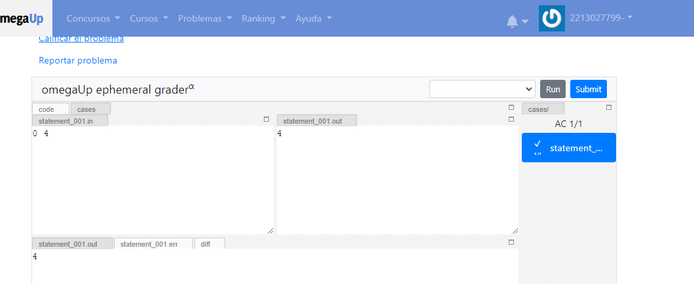
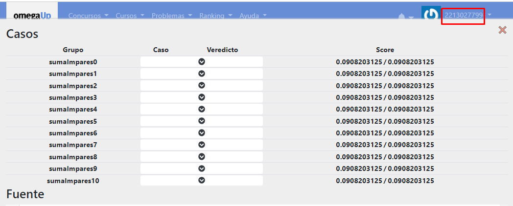
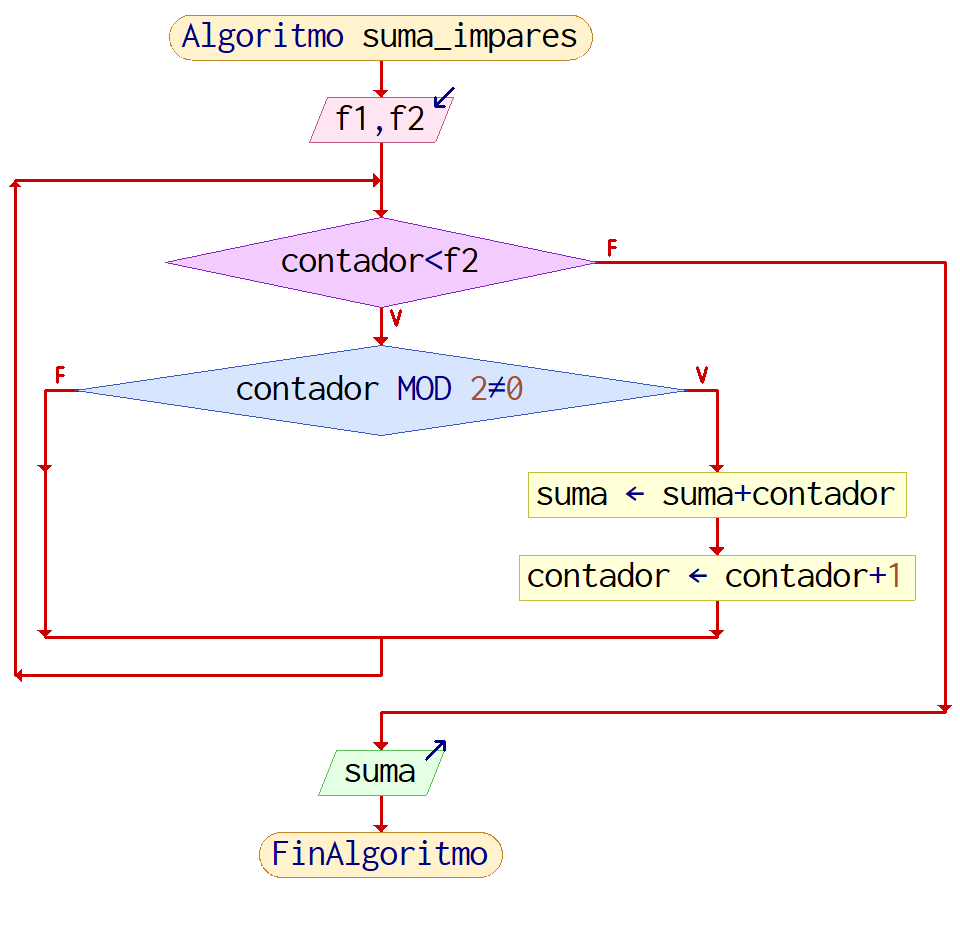
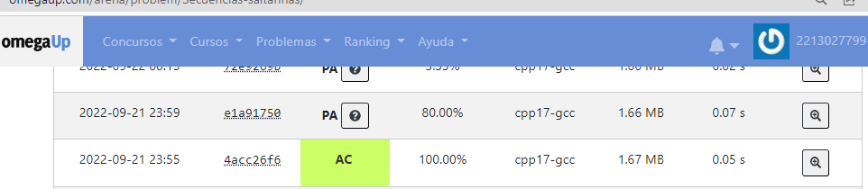
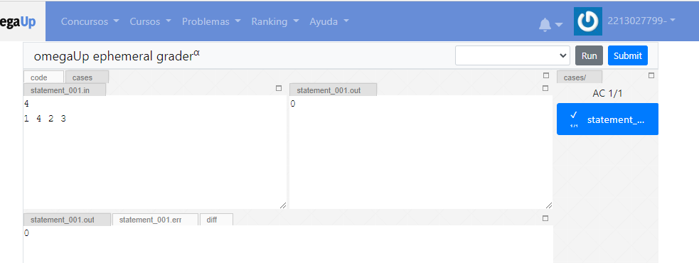
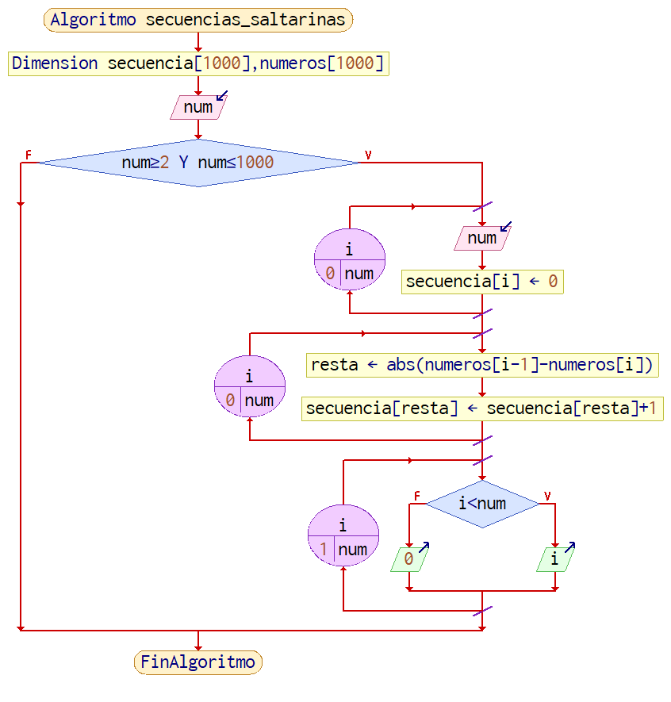
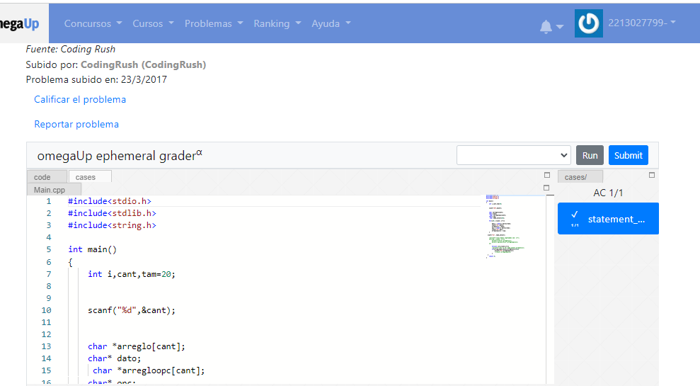
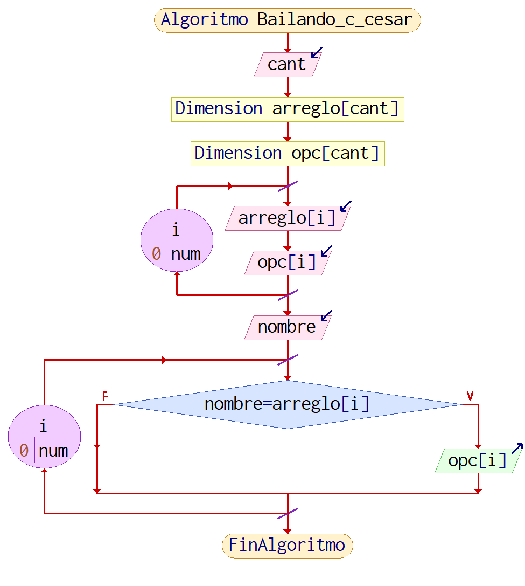

# Omega up

>Alberto Gutierrez Romero
> 2213027799

## Problema 1 
>Suma de impares

### Código:

```c
#include <stdio.h>
int main(){
    int f1=1, f2=0, contador=0, suma=0;
    scanf("%d %d", &f1 , &f2);
    suma=0;
    contador=f1;
    while( contador<= f2) {
        if( contador%2 != 0 ){
            suma+=contador;}
        contador++;}
    printf("%d",suma);
    return 0;}
```

### Ejecución




### Diagrama de flujo



# Omega up

## Problema 2
>Secuencias saltarinas

### Código:

```c
#include <stdio.h>
#include <stdlib.h>
int
main ()
{
  int i, num, resta;    
  int numeros[1000], secuencia[1000];  
  scanf ("%d", &num);    
  if ((num >= 2) && (num <= 1000))
    {        

      for (i = 0; i < num; i++)
  {
    scanf ("%d", &numeros[i]);  
    secuencia[i] = 0;
  }
      for (i = 1; i < num; i++)
  {
    resta = abs (numeros[i - 1] - numeros[i]);  
    secuencia[resta]++;
  }
      for (i = 1; (i < num) && secuencia[i]; i++); 

      if (i < num)
  {
    printf ("%d\n", i); 
  }
      else
  {
    printf ("0\n");
  }
      return 0;
    }
}
```

### Ejecución




### Diagrama de flujo



## Problema 3
>Bailando con cesar

### Código:

```c
#include<stdio.h>
#include<stdlib.h>
#include<string.h>

int main()
{
    int i,cant,tam=20;

    
    scanf("%d",&cant);
   

    char *arreglo[cant];
    char* dato;
     char *arregloopc[cant];
    char* opc;
     char name_select[20];

    for(i=0; i<cant; i++){
        
        dato = (char*) malloc(tam);
        scanf("%s",dato);
        arreglo[i] = dato;
        opc = (char*) malloc(tam);
        scanf("%s",opc);
        arregloopc[i] = opc;
    }
   
  scanf("%s", name_select);


        for(int i=0;i<cant;i++){
      
        if(strcmp(name_select,arreglo[i])==0){
            printf("%s",arregloopc[i]);
       
        }
  }
    return 0;
}
```

### Ejecución



### Diagrama de flujo


