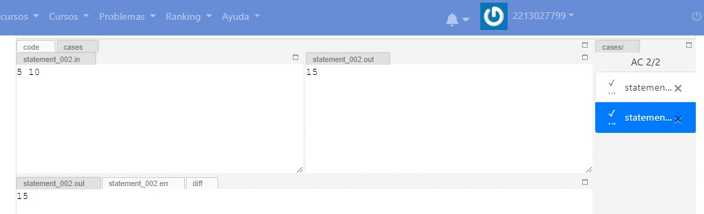
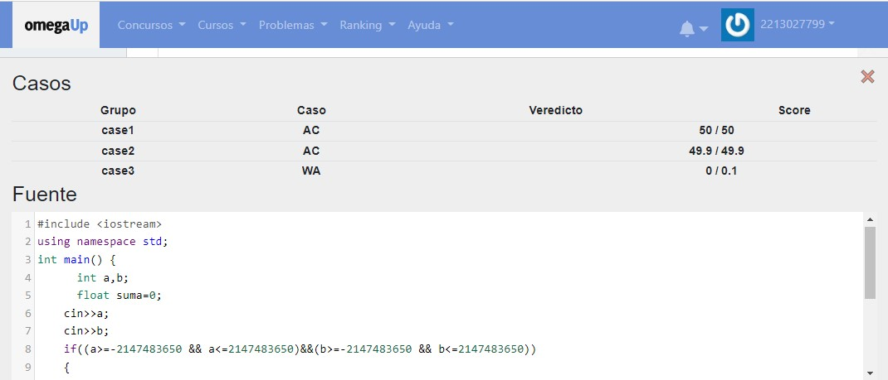
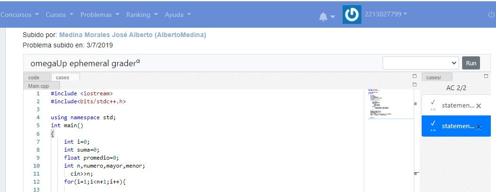
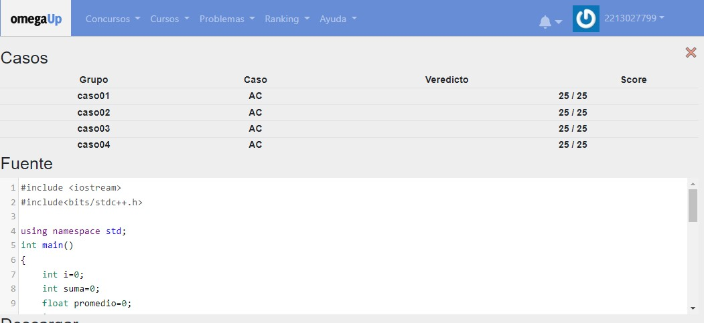
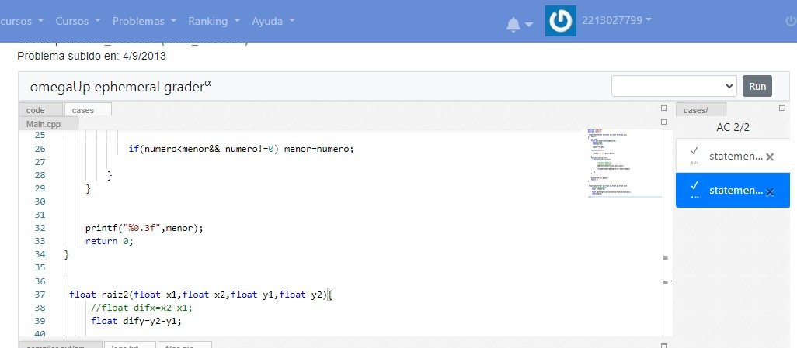
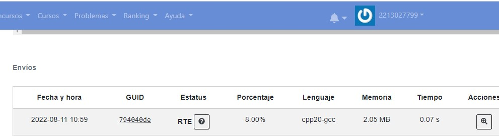
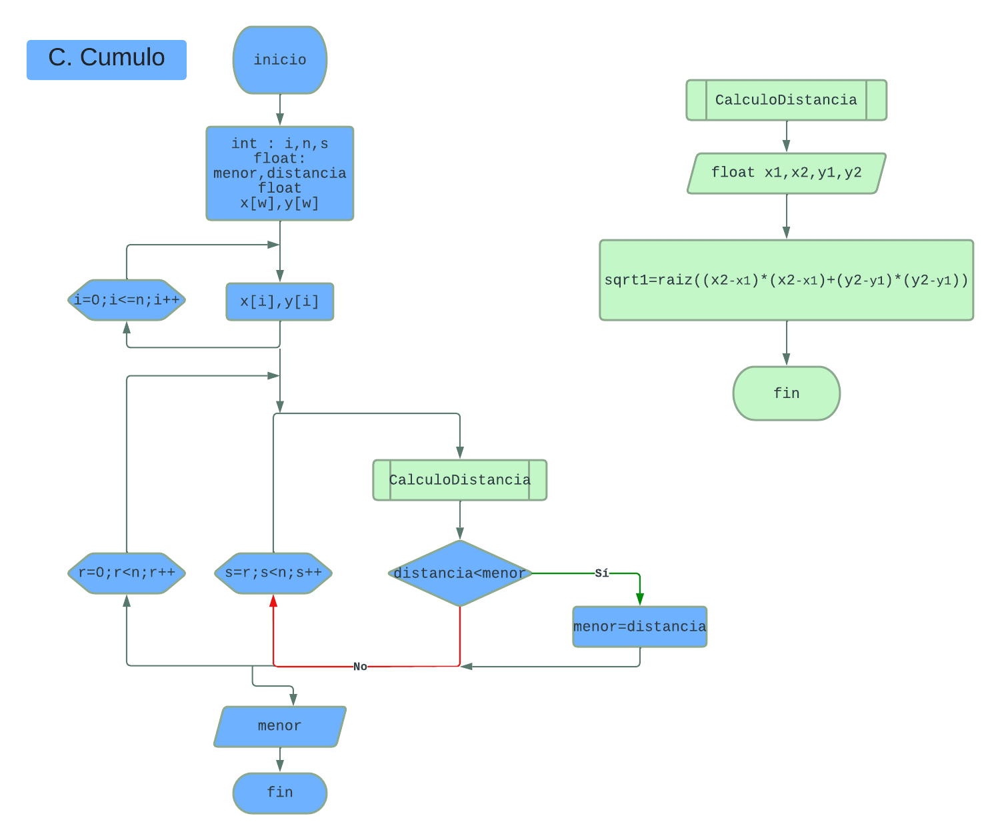

# Omega up

## Problema 1 
>Suma de enteros 

### Código:

```c
#include <iostream>
using namespace std;
int main() {
      int a,b;
      float suma=0;
    cin>>a;
    cin>>b;
    if((a>=-2147483650 && a<=2147483650)||(b>=-2147483650 && b<=2147483650))
    {
      suma=(float)a+(float)b;
    cout<<suma<<endl;
    }
    else{
       return 0 ;
    }
  
 
}
```

### Ejecución




### Diagrama de flujo


# Omega up

## Problema 2
>Suma Promedio Mayor y Menor

### Código:

```c
#include <iostream>
#include<bits/stdc++.h>

using namespace std;
int main()
{
    int i=0;
    int suma=0;
    float promedio=0;
    int n,numero,mayor,menor;
      cin>>n;
    for(i=1;i<n+1;i++){

        cin>>numero;
        suma=suma+numero;
        if(i==1){
            mayor=numero;
            menor=numero;
        }else{
             if(numero>mayor) mayor=numero;
             if(numero<menor) menor=numero;
        }
    }
    promedio=(suma*1000)/n;
    promedio=promedio/1000;
    cout<<suma<<" ";
    cout << fixed << setprecision(2) << promedio;
    cout<<" "<<mayor<<" "<<menor<<endl;


    return 0;
}
```

### Ejecución




### Diagrama de flujo
.png)


## Problema 3
>Cumulo

### Código:

```c
#include <stdio.h>
#include <math.h>

 float raiz2(float x1,float x2,float y1,float y2);
int main()
{
    int i=0;
    float n=0,menor=1000,numero=100;
      float x[100];
      float y[100];
    
      scanf("%f",&n);
    
    for(i=0;i<n;i++){

        scanf("%f %f",&x[i],&y[i]);
        
    }
    for(int r=0;r<n;r++){
        for(int s=0;s<n;s++){
            
          
            numero=raiz2(x[r],x[s],y[r],y[s]);
           
            if(numero<menor&& numero!=0) menor=numero;
        
        }
    }
    
    
    printf("%0.3f",menor);
    return 0;
}


 float raiz2(float x1,float x2,float y1,float y2){
    
 
 
     float sqrt1=sqrt((x2-x1)*(x2-x1)+(y2-y1)*(y2-y1));
     return sqrt1;
     
 }
```

### Ejecución




### Diagrama de flujo
