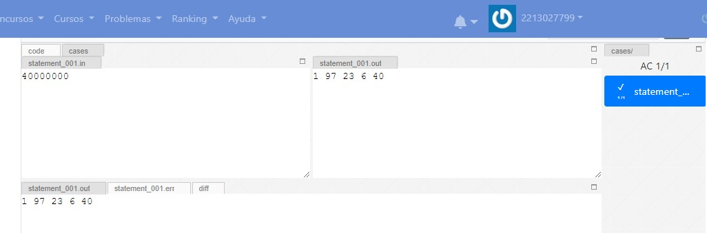
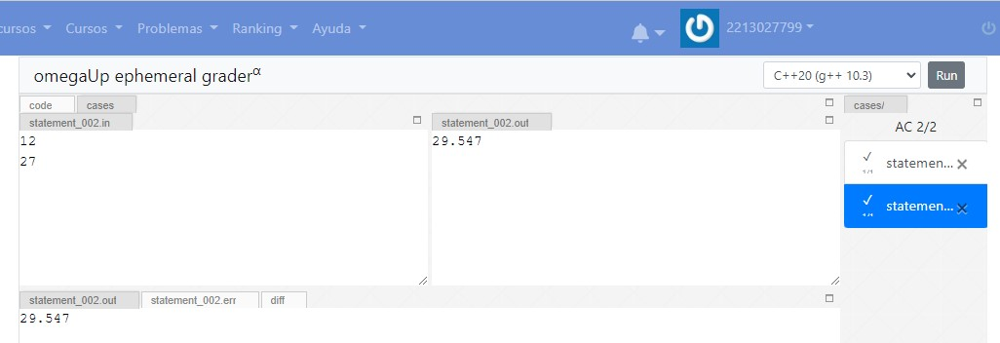
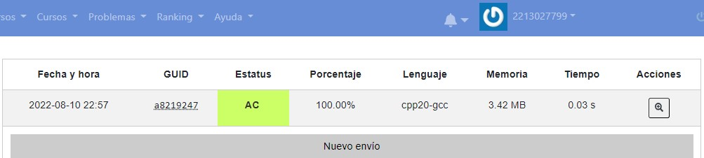

# Omega up

>Alberto Gutierrez Romero
> 2213027799

## Problema 1 
>Suma de enteros 

### Código:

```c
#include <iostream>
using namespace std;
int main() {
      int a,b;
      float suma=0;
    cin>>a;
    cin>>b;
    if((a>=-2147483650 && a<=2147483650)||(b>=-2147483650 && b<=2147483650))
    {
      suma=(float)a+(float)b;
    cout<<suma<<endl;
    }
    else{
       return 0 ;
    }
  
 
}
```

### Ejecución


### Diagrama de flujo


# Omega up

## Problema 2
>Suma Promedio Mayor y Menor

### Código:

```c
#include <iostream>
#include<bits/stdc++.h>

using namespace std;
int main()
{
    int i=0;
    int suma=0;
    float promedio=0;
    int n,numero,mayor,menor;
      cin>>n;
    for(i=1;i<n+1;i++){

        cin>>numero;
        suma=suma+numero;
        if(i==1){
            mayor=numero;
            menor=numero;
        }else{
             if(numero>mayor) mayor=numero;
             if(numero<menor) menor=numero;
        }
    }
    promedio=(suma*1000)/n;
    promedio=promedio/1000;
    cout<<suma<<" ";
    cout << fixed << setprecision(2) << promedio;
    cout<<" "<<mayor<<" "<<menor<<endl;


    return 0;
}
```

### Ejecución


### Diagrama de flujo
.png)


## Problema 3
>Cumulo

### Código:

```c
#include <stdio.h>
#include <math.h>

 float raiz2(float x1,float x2,float y1,float y2);
int main()
{
    int i=0;
    float n=0,menor=1000,numero=100;
      float x[100];
      float y[100];
    
      scanf("%f",&n);
    
    for(i=0;i<n;i++){

        scanf("%f %f",&x[i],&y[i]);
        
    }
    for(int r=0;r<n;r++){
        for(int s=0;s<n;s++){
            
          
            numero=raiz2(x[r],x[s],y[r],y[s]);
           
            if(numero<menor&& numero!=0) menor=numero;
        
        }
    }
    
    
    printf("%0.3f",menor);
    return 0;
}


 float raiz2(float x1,float x2,float y1,float y2){
    
 
 
     float sqrt1=sqrt((x2-x1)*(x2-x1)+(y2-y1)*(y2-y1));
     return sqrt1;
     
 }
```

### Ejecución


### Diagrama de flujo


## Problema 4
>La medida del tiempo

### Código:

```c
#include <iostream>
using namespace std;
int constant[]={31536000,86400,3600,60};
int var[4];
int s=0,aux=0;

int main() {

  cin>>s;
  for(int i=0;i<4;i++){
    var[i]=s/constant[i];
    aux=s%constant[i];
    s=aux;
    cout<<var[i]<<" ";
  }
    cout<<s;  

  return 0;
}
 }
```

### Ejecución



### Diagrama de flujo
.png)


## Problema 5
>Pitagoras

### Código:

```c

#include <stdio.h>
#include <math.h>


float a=0,b=0,c=0;
int main() {

  if(scanf("%f",&a)&&scanf("%f",&b));  {
    if(a>0 && a<3000 && b>0 && b<3000){
     c=sqrt(a*a+b*b);

  printf("%0.3f", c);

  }
  }
 

  return 0;
}
```

### Ejecución



### Diagrama de flujo


## Problema 6
>Parejas disparejas

### Código:

```c

#include <iostream>
using namespace std;
int n,m;

int s(int x);
void parejas(int x,int y);

int main()
{
    cin>>m>>n;
    parejas(m,n);
    parejas(m,m);
    parejas(n,n);
    


    return 0;
}

int s(int x){
    int aux=0,aux2=0,out_aux=0,out=0;
    for(int i=2;i<=x;i++){
        aux=x%i;
        if(aux==0){
            out_aux=x/i;
            //cout<<out_aux<<" "<<i<<"|"<<endl;
            out=out+out_aux;
        }
        
    }
    
    return out;

}

void parejas(int m, int n){
        if(s(m)==n && s(n)==m){
            cout<<"0 ";
        }else if(s(m)<=n && s(n)<=m){
            cout<<"1 ";
        }else if(s(m)>=n && s(n)>=m){
            cout<<"2 ";
        }else{
            cout<<"3 ";
        }
    
}
```

### Ejecución


### Diagrama de flujo


## Problema 7
>Un algoritmo de Gauss poco conocido

### Código:

```c

#include <iostream>

using namespace std;
int a,b,c,d,e,f,g,h,i,j,m;

int main()
{
    cin>>a;
    b=(a/100)+1;
    c=((3*b)/4)-12;
    e=(a%19)+1;
    f=((8*b)+5)/25-(5+c);
    g=5*a/4-(c+10);
    h=(11*e+20+f)%30;
    if(h!=25){
        if(h==24)h++;
    }
    if(e>11)h++;
    i=44-h;
    if(i<21)i=i+30;
    j=i+7-((g+i)%7);
    if(j<=31){
        d=j;
        m=3;
    }else{
        d=j-31;
        m=4;
    }
    
    cout<<d<<" "<<m;
    
    
    return 0;
}
```

### Ejecución




### Diagrama de flujo


