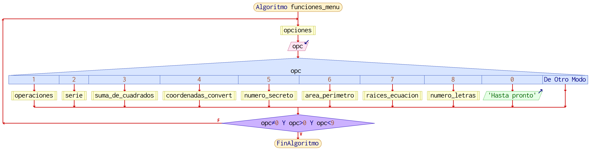

# FundamentosDeProgramacion
## Examen de funciones


## Funcion principal **main()**

>El siguiente codigo muestra los programas vistos en clase , implementados como funciones.Mientras en la funcion **main()** se implementa un menu con las opciones a seleccionar que invocan las funciones mostradas a continuacion

### Librerias utilizadas:

```c
#include <stdio.h>
#include <stdlib.h>
#include<math.h>
```

### Definicion de constantes:

```c
#define PI 3.14159265
#define CONSTANTE 20
```

### Declaracion de funciones:
```c
void opciones();
void polar_to_cartesian();
void cartesian_to_polar();
void numero_secreto();
void raices_ecuacion();
void area_perimetro();
void numero_letras();
void suma_de_cuadrados();
void operaciones();
void serie();
void coordenadas_convert();
```

### Código de la funcion **main()**:

```c
int main() {
    do {

    opciones();    
    scanf("%d",&opc);
    
    switch (opc) {
        case 1:
            operaciones();
            break;
        case 2:
            serie();
            break;
        case 3:
            suma_de_cuadrados();
            break;
        case 4:
            coordenadas_convert();
            break;
        case 5:
            numero_secreto();
            break;
        case 6:
            area_perimetro();
            break;
        case 7:
            raices_ecuacion();
            break;
        case 8:
            numero_letras();
            break;
        case 0:
            printf("Hasta pronto");
            break;
        default:
            printf("Valor invalido");
            break;
    }
    
    } while(opc!=0 && opc>0 && opc<9);

return 0;

}

```
### Pseudocodigo

```
Algoritmo funciones_menu
    Repetir
        opciones
        Leer opc
        Segun opc  Hacer
            1:
                operaciones
            2:
                serie
            3:
                suma_de_cuadrados
            4:
                coordenadas_convert
            5:
                numero_secreto
            6:
                area_perimetro
            7:
                raices_ecuacion
            8:
                numero_letras
            0:
                Escribir 'Hasta pronto'
        FinSegun
    Hasta Que opc≠0 Y opc>0 Y opc<9
FinAlgoritmo
```

### Diagrama de flujo


### Ejecución
[](https://youtu.be/5shqNMgpoME?t=5)

[Main link](https://youtu.be/5shqNMgpoME?t=5)

---


## Funcion  **opciones()**

>text...


### Código de la funcion **opciones()**:

```c
void opciones(){
    
    printf("\nSelecciona una opcion:");
    printf("\n------------------------------------------------------------------");
    printf("\n");
    printf("\n\t1-Suma resta multiplicacion, division de numeros enteros");
    printf("\n\t2-Serie 1 1 2 3 5 8 13");
    printf("\n\t3-Desplegar la suma de cuadrados");
    printf("\n\t4-Conversion de coordenadas");
    printf("\n\t5-Numero secreto");
    printf("\n\t6-Calcular area y perímetro");
    printf("\n\t7-Raices de ecuación cuadratica");
    printf("\n\t8-Convertir numero a letras");
    printf("\n\t0-Salir");
    printf("\n\t");
}

```
### Pseudocodigo

```html
Algoritmo funciones_menu
    Repetir
        opciones
        Leer opc
        Segun opc  Hacer
            1:
                operaciones
            2:
                serie
            3:
                suma_de_cuadrados
            4:
                coordenadas_convert
            5:
                numero_secreto
            6:
                area_perimetro
            7:
                raices_ecuacion
            8:
                numero_letras
            0:
                Escribir 'Hasta pronto'
        FinSegun
    Hasta Que opc≠0 Y opc>0 Y opc<9
FinAlgoritmo
```

### Diagrama de flujo


### Ejecución
[](https://youtu.be/5shqNMgpoME?t=3)

[Opciones link](https://youtu.be/5shqNMgpoME?t=3)


---

## Funcion  **operaciones()**

>text...

### Código de la funcion **operaciones()**:

```c
void operaciones(){
    
    float numero1,numero2;
    float suma, multiplicacion, division, resta;
    /* lectura de datos (entradas) */
    printf("\n--------Operaciones---------");
    printf("\nIngrese numero A:\t");
    scanf("%f",&numero1);
    printf("\nIngrese numero B:\t");
    scanf("%f",&numero2);
    
    suma = numero1 + numero2;
    resta = numero1 - numero2;
    multiplicacion = numero1 * numero2;
    division = numero1 / numero2;
    /* desplegado de datos (salidas) */
    printf("\n--------Resultados----------");
    printf("\nSuma:        \t%.3f \n", suma);
    printf("Resta:         \t%.3f\n", resta);
    printf("Multiplicacion:\t%.3f\n", multiplicacion);
    printf("Division:      \t%.3f\n", division);
}
```
### Pseudocodigo

```html
Funcion operaciones
    Definir numero1,numero2,suma,multiplicacion,division,resta Como Real
    Escribir '--------Operaciones---------'
    Escribir 'Ingrese numero A'
    Leer numero1
    Escribir 'Ingrese numero B:'
    Leer numero2
    suma ← numero1+numero2
    resta ← numero1-numero2
    multiplicacion ← numero1*numero2
    division ← numero1/numero2
    Escribir 'suma ',suma
    Escribir 'Resta:',resta
    Escribir 'Multiplicacion:',multiplicacion
    Escribir 'Division:',division
FinFuncion
```

### Diagrama de flujo


### Ejecución
[](https://youtu.be/5shqNMgpoME?t=8)

[Operaciones link](https://youtu.be/5shqNMgpoME?t=8)


---


## Funcion  ***serie()***

>text

### Código de la funcion **serie()**:

```c
void serie(){
    int i, j, serie, N, cont;
        printf("\nIngrese el numero de valores de la sucesion:\t");
        scanf("%d", &N);
        printf("\n");
        i=0;
        j=1;
        for(cont=0; cont<N; cont++)
        {
            serie=i+j;
            printf("%d ", serie);
            i=j;
            j=serie;
        }
        printf("\n");
}

```
### Pseudocodigo

```html
Funcion serie
    Definir i,j,res,n,cont Como Entero
    Escribir 'Ingrese el numero de valores de la sucesion:'
    Leer n
    Para cont←0 Hasta n Hacer
        res ← i+j
        Escribir res
        i ← j
        j ← res
    FinPara
FinFuncion
```

### Diagrama de flujo
 

### Ejecución
[](https://youtu.be/5shqNMgpoME?t=18)

[Serie link](https://youtu.be/5shqNMgpoME?t=18)


---

## Funcion  **suma_de_cuadrados**

>text...

### Código de la funcion ****:

```c
void suma_de_cuadrados(){
    int x=0;
    int n=0;
    int contador=0;
    int cuadrado=0;
    int impares=0;

    printf("Secuencia de suma de cuadrados\n");
    printf("Ingresa los numeros a mostrar:\t");
    scanf("%d",&n);
    
    for(contador=1; contador<=n; contador++){
       printf("\nNo. %d = ",contador);
       cuadrado=0;
       x=1;
       do{
           printf("%d",impares);
           if(x<contador) printf("+");
           cuadrado+=impares;
           impares+=2;
           x++;
       }while(x<=contador);
       
        printf("= %d",cuadrado);
    }
    printf("\n");
    
}
```
### Pseudocodigo

```html
Funcion suma_de_cuadrados
	Definir x,n,contador,cuadrado,impares Como Entero
	Escribir 'Secuencia de suma de cuadrados'
	Escribir 'Ingresa los numeros a mostrar:'
	Leer  n
	
	Para contador<-0 Hasta n Hacer 
		Escribir 'No. =',contador
		cuadrado=0
		x=1
		Repetir
			Escribir impares
			si x<contador
				Escribir '+'
				cuadrado=contador+impares
				impares=impares+2
				x=x+x
			FinSi
		Hasta Que x<=contador 
	FinPara
	
FinFuncion
```

### Diagrama de flujo


### Ejecución
[](https://youtu.be/5shqNMgpoME?t=27)

[Suma_de_cuadrados link](https://youtu.be/5shqNMgpoME?t=27)


---

## Funcion  **coordenadas_convert**

>text...

### Código de la funcion ****:

```c
void coordenadas_convert(){
    printf("\n       Conversion de coordenadas           ");
    printf("\n-------------------------------------------");
    printf("\n");
    printf("\n1-Polares a cartesianas");
    printf("\n2-Cartesianas a polares");
    printf("\nIngresa una opción:\t");
    scanf("%d",&opc4);

    switch (opc4)
    {
    case 1:
        polar_to_cartesian();
        break;
    case 2:
        cartesian_to_polar();
        break;    
    default:
        printf("Opcioón invalida");
        break;
    }

}

void polar_to_cartesian(){

    double val = PI / 180;
    double theta,r,x,y;

    printf("Ingrese valor de magnitud(r):   \t");
    scanf("%lf",&r);
    printf("Ingrese valor de angulo(grados):\t");
    scanf("%lf",&theta);              

        x=r*cos(theta*val);
        y=r*sin(theta*val);
    printf("\nSalida de coordenadas cartesianas:");
    printf("\n-----------------------------------");
    printf("\n( x = %0.3lf , y = %0.3lf )\n",x,y);    
}

void cartesian_to_polar(){

    double theta=0,r=0,x=0,y=0;
    double val = PI / 180;
    printf("\nIngrese valor de x:\t");
    scanf("%lf",&x);
    printf("Ingrese valor de y:\t");
    scanf("%lf",&y);       
               
        r=sqrt(x*x+y*y);
        theta=atan(y/x);
        theta/=val;

    printf("\nSalida de coordenadas polares:");
    printf("\n------------------------------\n");
    printf("r =   \t %0.3lf \ntheta =\t %0.3lf\n",r,theta);   

}
```
### Pseudocodigo

```html
Funcion coordenadas_convert
	Escribir '1-Polares a cartesianas' 
	Escribir '1-2-Cartesianas a polares' 
	Escribir 'ingresa opcion'
	segun opc Hacer
		1:
			polar_to_cartesian
		2:
			cartesian_to_polar
					
	FinSegun
FinFuncion

Funcion polar_to_cartesian
	definir val, theta,r,x,y_ como numero
	val=3.1416/180
	Escribir 'Ingresa magnitud'
	Leer r
	Escribir 'Ingresa angulo'
	Leer theta	
	x=r*cos(theta*val)
	y_=r*sen(theta*val)
	
	Escribir x
	Escribir y_
	
FinFuncion

Funcion cartesian_to_polar
	definir val, theta,r,x,y_ como numero
	val=3.1416/180
	
	Escribir 'Ingresa x'
	Leer z
	Escribir 'Ingresa y'
	Leer y_
	
	r=raiz(x*x+y_*y_)
	theta=atan(y_/x)
	
	Escribir r
	Escribir theta
	
FinFuncion
```

### Diagrama de flujo


### Ejecución
[](https://youtu.be/5shqNMgpoME?t=35)

[Opciones link](https://youtu.be/5shqNMgpoME?t=35)


---

## Funcion  ****

>text...

### Código de la funcion ****:

```c

```
### Pseudocodigo

```html

```

### Diagrama de flujo


### Ejecución
[](https://youtu.be/5shqNMgpoME?t=3)

[Opciones link](https://youtu.be/5shqNMgpoME?t=3)

---

## Funcion  ****

>text...

### Código de la funcion ****:

```c

```
### Pseudocodigo

```html

```

### Diagrama de flujo


### Ejecución
[](https://youtu.be/5shqNMgpoME?t=3)

[Opciones link](https://youtu.be/5shqNMgpoME?t=3)

---

## Funcion  ****

>text...

### Código de la funcion ****:

```c

```
### Pseudocodigo

```html

```

### Diagrama de flujo


### Ejecución
[](https://youtu.be/5shqNMgpoME?t=3)

[Opciones link](https://youtu.be/5shqNMgpoME?t=3)

---